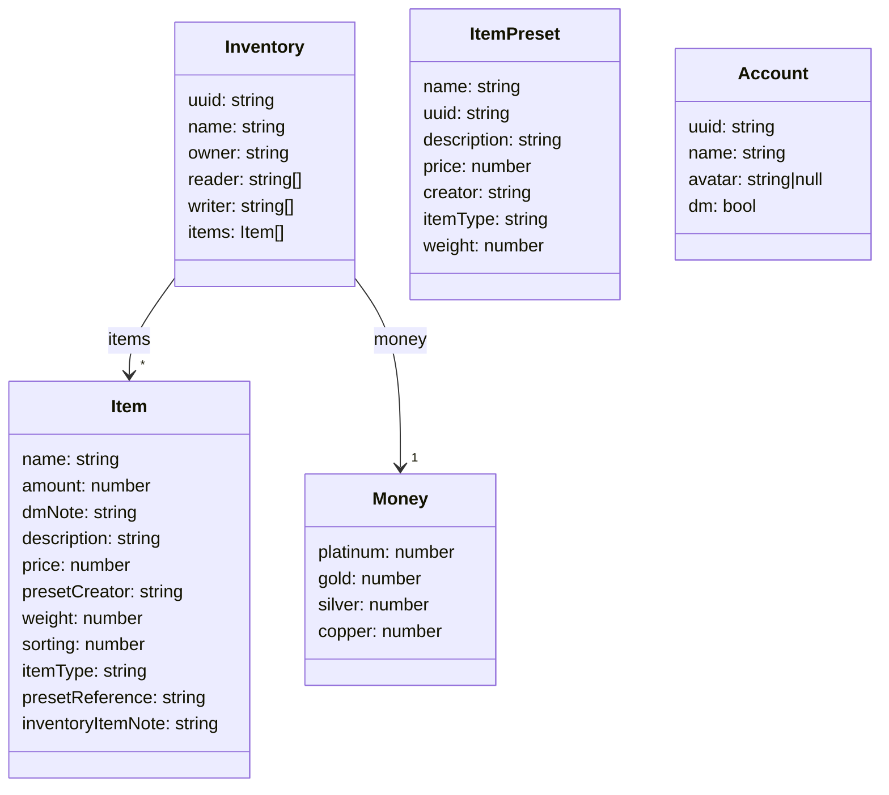

# InventarWerk
## Deployment
I recommand deploying the Inventarwerk with docker simply build the Docker image i.e with the following command:
```bash
docker build -t inventarwerk .
```
and run it:
```bash
docker run -d -p "80:8000" --env-file .env inventarwerk
```
I suggest keeping the database persistant by setting the db path to `db/database.db` and mounting the `/app/src/db` directory (but this seems to not function in wsl, i suggest running it in pure linux):
```bash
docker run -d -p "80:8000" -v ./db:/app/src/db --env-file .env inventarwerk
```
I would also suggest running it behind a reverse proxy that use ssl. My docker compose setup looks like:
```yaml
services:
  inventarwerk:
    networks:
      ngninxbridge:
        ipv4_address: xxx.xxx.xxx.xxx
    volumes:
      - ./db:/usr/src/app/db
    container_name: inventarwerk
    env_file: .env
    image: inventarwerk
    restart: unless-stopped

networks:
  ngninxbridge:
    name: ngninxbridge
    external: true
```
Nginx runs in another container, that routes the traffic over the nginxbridge to the container.
## Dockerfile
The Dockerfile supports build args i.e. "--build-arg FEATURES="--features dev-deploy""
## Anforderungen
- Verschiede Inventare
  - Teil-Stufen: privat (geteilt nur mit dir), geteilt (m r/w), public
- Inventar verwaltet Items
- Jedes Inventar hat Geld
- Mathe in Betragsmengen-Feldern
- DM Notes
- Account System (Discord)
- Item presets speichern
- Jedes Item hat: Name, Wert, text

## Frontend model


