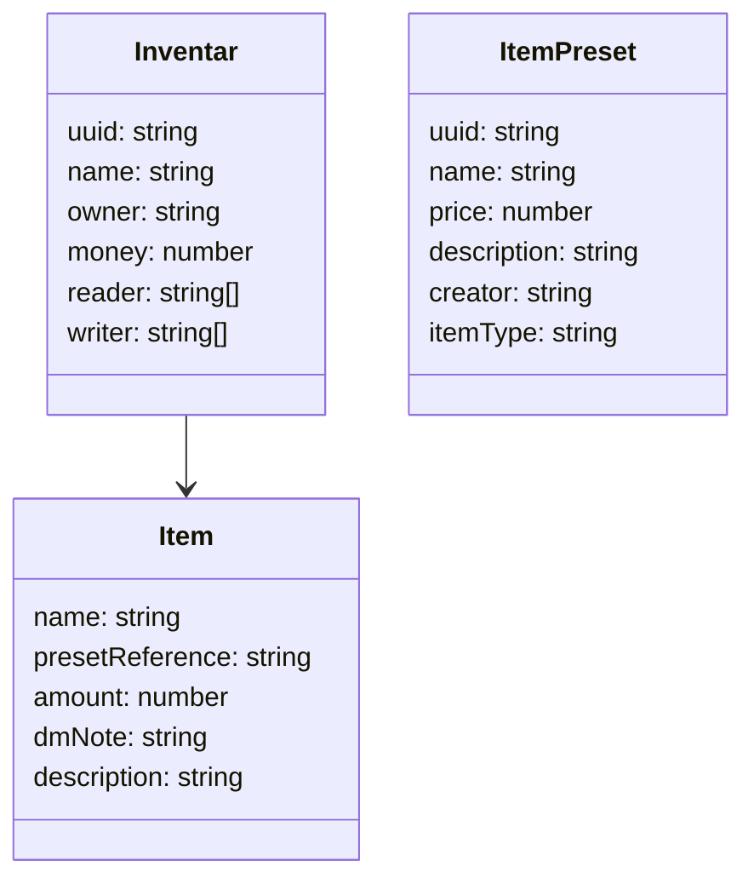
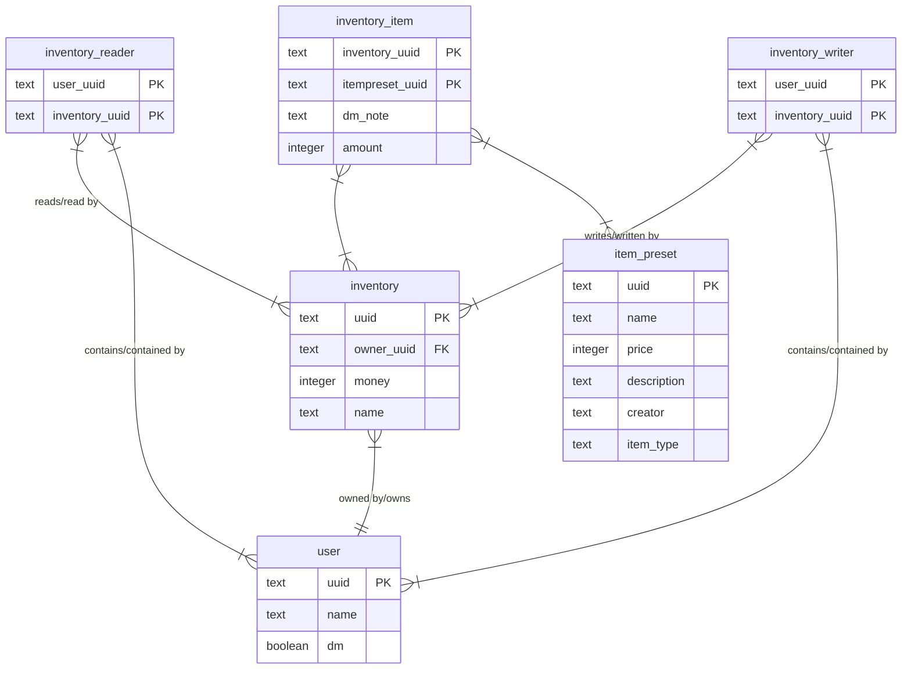

# InventarWerk

## Anforderungen
- Verschiede Inventare
  - Teil-Stufen: privat (geteilt nur mit dir), geteilt (m r/w), public
- Inventar verwaltet Items
- Jedes Inventar hat Geld
- Mathe in Betragsmengen-Feldern
- DM Notes
- Account System (Discord)
- Item presets speichern
- Jedes Item hat: Name, Wert, text

## Structure


## Schnittstellen
Any Endpoint other than `/account/login` or `/account/oauth/callback` requires authentication through `/account/login`
### Inventar
#### /inventar/all
Get
Returns all inventories from the logged in user
Response:
```json
{
    "inventories": [
        {
            "uuid": "some uuid",
            "name": "some name",
            "owner": "some owner uuid",
            "money": 69,
            "items": [
                // ...
            ],
            "reader": ["some uuid", "some uuid", "..."],
            "writer": ["some uuid", "..."]

        }//, ...
    ]
}
```
#### /inventar?inventory_uuid=""
Get
Returns the inventory with the given uuid
Response:
```json
{
    "uuid": "the requested uuid",
    "name": "some name",
    "owner": "some owner uuid",
    "money": 42,
    "reader": ["some uuid", "some uuid", "..."],
    "writer": ["some uuid", "..."]

}
```
#### /inventar?name=""
Put
Creates a new inventory
Response:
```json
{
    "uuid": "a new uuid",
    "name": "name from the request",
    "owner": "the uuid of the logged in user",
    "money": 0,
    "reader": ["the uuid of the logged in user"],
    "writer": ["the uuid of the logged in user"]

}
```
#### /inventar/addPreset?inventory_uuid="",preset_uuid="",amount=""
Put
Adds an new item to the inventory (dont increase amount fom 0->1 or 3->4)
Response:
201
#### /inventar/addNew?inventory_uuid="",name="",amount=""
Put
Creates an itempreset with the given name and adds it to the inventory, returns the item class from frontend
Response:
```json
{
    "name": "the given name",
    "presetReference": "the uuid of the item preset",
    "amount": 0, // the given amount
    "dmNote": "",
    "description": ""

}
```
#### /inventar/removeItem?innventory_uuid="",item_preset_uuid=""
Delete
Deletes the given item preset from the given iventory
Response: 204
#### /inventar/money?inventory_uuid="",amount=""
Patch
Edits the Amount of Money in an Inventory
Response: 204
#### /inventar/share?uuid="",reader_uuid="",writer_uuid=""
Patch
Makes an inventory visible to other members of the site
reader_uuid and writer_uuid contains the uuid of the members that shoud get read/write access to the inventory
reader_uuid and writer_uuid are optional, if they both dont exists, all members get read acces to the inventory
Response:204
#### /inventar/delete?uuid=""
Delete
deletes an inventory
Response: 204
### Item
#### /item/edit?inventory_uuid="",item_preset_uuid="",amount=""
Patch
changes the amount of an itemPreset in an inventory
Response: 204
#### /item/addNote?inventory_uuid="",item_preset_uuid="",note=""
Patch
Adds an dm note to an item
REQUIRES AN DM ACCOUNT
Response:201
### ItemPreset
#### /itemPreset?item_preset_uuid=""
Get
returns the item preset with the given uuid
Response: 
```json
{
    "uuid": "owner uuid",
    "name": "item preset name",
    "price": 0,
    "description": "a description",
    "creator": "creator uuid",
    "itemType": "item type"
}
```
#### /itemPreset/modify?item_preset_uuid="",name="",price="",description="",item_type=""
Patch
all optional expect item_preset_uuid
Response: 204
#### /itemPreset/delete?item_preset_uuid=""
Delete
Deletes an itemPreset
Response: 204
#### /itemPreset/all
Get
Returns all itemPreset reduced
Response:
```json
{
    "item_presets": [{
        "name":"name",
        "itemType":"type"
    }//,...
    ]
}
```
### Account
#### /account/get
Get
returns all accounts
Response:
```json
{
    "accounts": [
        {
            "name":"name",
            "uuid":"uuid"
        }//,...
    ]
}
```
#### /account/isDm?uuid=""
Get
Returns if the account is dm
Response:
```json
{
    "isDm":true // or false
}
```
#### /account/login
redirects to the discord login page
#### /account/oauth/callback
handles the redirect from the oauth
#### /account/info
debug page, displays the account id
### last Changes
#### /lastChanges?timestamp=""
Get
time stamp of last fetch in millis
Response: {uuid: string, type: 'create'|'patch'|'delete'}[]


# Backend
##
required fields in .enc in backend/
```
DATABASE_URL=
DISCORD_CLIENT_ID=
DISCORD_CLIENT_SECRET=
DISCORD_REDIRECT_URI=
```
## Prerequisites
install libsqlite3-dev
```
sudo apt update
sudo apt install libsqlite3-dev
```

set `DATABASE_URL=` in .env in backend/
change migrations path in diesel.toml in backend/

## Database Structure

