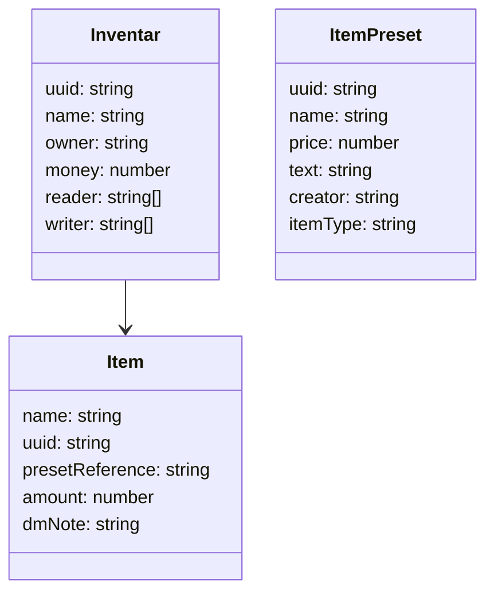

# InventarWerk

## Anforderungen
- Verschiede Inventare
  - Teil-Stufen: privat (geteilt nur mit dir), geteilt (m r/w), public
- Inventar verwaltet Items
- Jedes Inventar hat Geld
- Mathe in Betragsmengen-Feldern
- DM Notes
- Account System (Discord)
- Item presets speichern
- Jedes Item hat: Name, Wert, text

## Structure


## Schnittstellen
### /inventar/all
Get
### /inventar?uuid=""
Get
### /itemPreset?uuid=""
Get
### /inventar?name=""
Put
### /inventar/addPrest?presetUuid="",amount=""
Put
### /inventar/addNew?name="",amount=""
Put
### /inventar/delete?uuid=""
Delete
### /inventar/money?amount=""
Patch
### /inventar/modifyAmount?uuid="",amount=""
Patch
### /inventar/share
Patch
machts public
### /inventar/share?userid="",write=""
Patch
### /account/get
Get
return all accounts
### /note/add?uuid="",note=""
Patch
### /itemPreset/modify?uuid="",name="",price="",text=""
Patch
all optional
### /itemPreset/delete?uuid=""
Delete
### /lastChanges
Get
time stamp of last changes in millis
### /itemPreset/all
Get
### /account/isDm
Get


# Backend
## Prerequisites
install libsqlite3-dev
```
sudo apt update
sudo apt install libsqlite3-dev
```

set `DATABASE_URL=` in .env in backend/
change migrations path in diesel.toml in backend/
