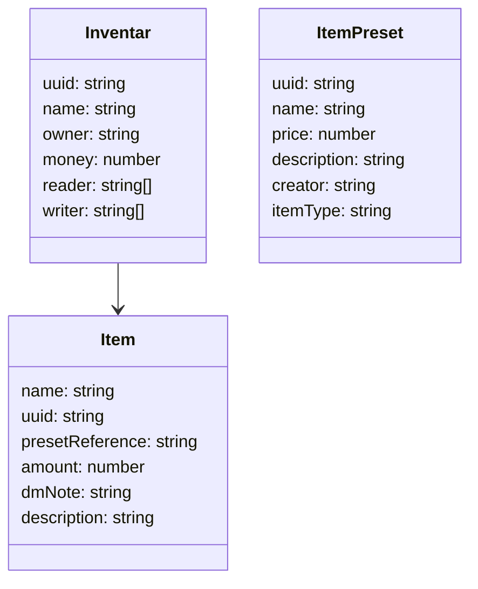

# InventarWerk

## Anforderungen
- Verschiede Inventare
  - Teil-Stufen: privat (geteilt nur mit dir), geteilt (m r/w), public
- Inventar verwaltet Items
- Jedes Inventar hat Geld
- Mathe in Betragsmengen-Feldern
- DM Notes
- Account System (Discord)
- Item presets speichern
- Jedes Item hat: Name, Wert, text

## Structure


## Schnittstellen
### Inventar
#### /inventar/all
Get
#### /inventar?inventory_uuid=""
Get
#### /inventar?inventory_uuid="",name=""
Put
#### /inventar/addPreset?inventory_uuid="",preset_uuid="",amount=""
Put
#### /inventar/addNew?name="",amount=""
Put
#### /inventar/money?amount=""
Patch
#### /inventar/share?uuid=""
Patch
machts public
#### /inventar/share?uuid="",read="",write=""
Patch
#### /inventar/delete?uuid=""
Delete
### Item
#### /item/edit?uuid="",name="",amount="",description=""
Patch
name, amount and description are optional
### ItemPreset
#### /itemPreset?uuid=""
Get
#### /itemPreset/modify?uuid="",name="",price="",text=""
Patch
all optional
#### /itemPreset/delete?uuid=""
Delete
#### /itemPreset/all
Get
Response: List of {name: string, itemType:string}
### Account
#### /account/get
Get
return all accounts
#### /account/isDm?uuid=""
Get
### Note
#### /note/add?uuid="",note=""
Patch
### last Changes
#### /lastChanges?timestamp=""
Get
time stamp of last fetch in millis
Response: {uuid: string, type: 'create'|'patch'|'delete'}[]


# Backend
##
required fields in .enc in backend/
```
DATABASE_URL=
DISCORD_CLIENT_ID=
DISCORD_CLIENT_SECRET=
DISCORD_REDIRECT_URI=
```
## Prerequisites
install libsqlite3-dev
```
sudo apt update
sudo apt install libsqlite3-dev
```

set `DATABASE_URL=` in .env in backend/
change migrations path in diesel.toml in backend/

## Database Structure

