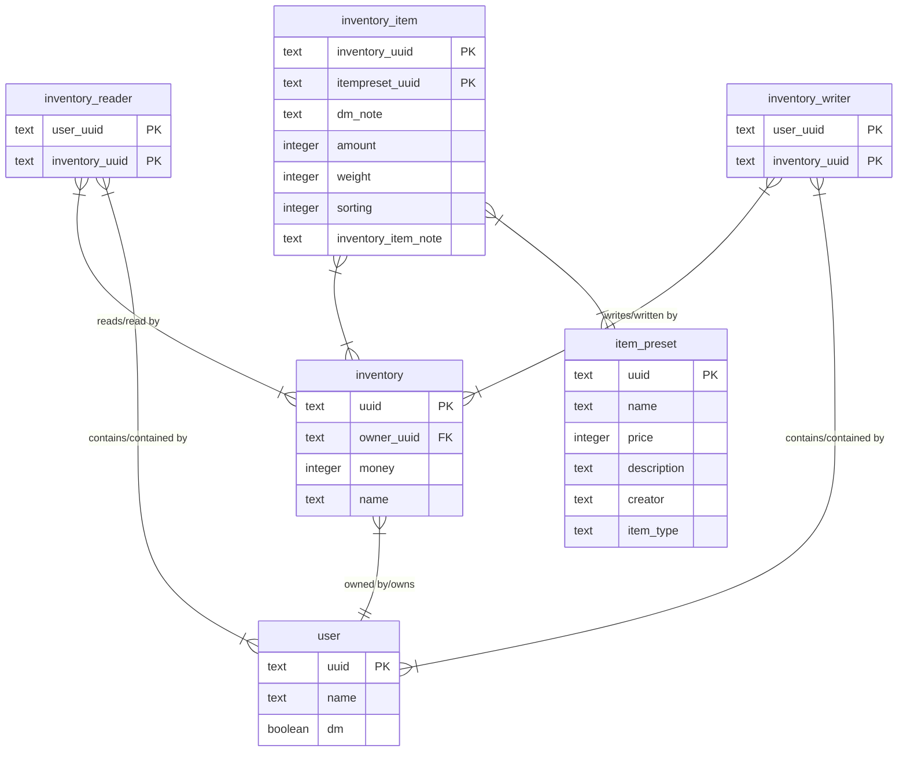

# Backend
This file contains the definition of the api and the database model, both should be kept up to date in future development

##
fields in .env in backend/
```
DATABASE_URL=
DISCORD_CLIENT_ID=
DISCORD_CLIENT_SECRET=
DISCORD_REDIRECT_URI=

ROCKET_ADDRESS=
ROCKET_PORT=
```
## Prerequisites
install [rust](https://www.rust-lang.org/tools/install) 
install [diesel-cli](https://diesel.rs/guides/getting-started.html#installing-diesel-cli)
move into the backend folder

set `DATABASE_URL=` in .env in backend/
i suggest database.db

run diesel setup
if you encounter sql errors installing libsqlite3-dev might help (on wsl, search for other packages if you dont use wsl/ubuntu) and run `diesel migration run`, this should not be neccessary if the setup, doesnt encountered an error
```
sudo apt update
sudo apt install libsqlite3-dev
```


go to the [discord developer portal](https://discord.com/developers) and create a application and generate the client secret
set DISCORD_CLIENT_ID, DISCORD_CLIENT_SECRET, DISCORD_REDIRECT_URI in the env file the DISCORD_REDIRECT_URI should be yourdomain.de/account/oauth/callback, also add the url to the redirects in the discord developer portal.

if you move the backend folder dont forget to change migrations path in diesel.toml in backend/

set ROCKET_ADDRESS and ROCKET_PORT if you dont want to use the default config of rocket.

finally run `cargo run`

## API
Any Endpoint other than `/account/login` or `/account/oauth/callback` requires authentication through `/account/login`
### Inventory
#### /inventory/all
Get
Returns all inventories from the logged in user
Response:
```json
{
    "inventories": [
        {
            "uuid": "some uuid",
            "name": "some name",
            "owner": "some owner uuid",
            "money": 69,
            "items": [
                // ...
            ],
            "reader": ["some uuid", "some uuid", "..."],
            "writer": ["some uuid", "..."]

        }//, ...
    ]
}
```
#### /inventory?inventory_uuid=""
Get
Returns the inventory with the given uuid
Response:
```json
{
    "uuid": "the requested uuid",
    "name": "some name",
    "owner": "some owner uuid",
    "money": 42,
    "reader": ["some uuid", "some uuid", "..."],
    "writer": ["some uuid", "..."]

}
```
#### /inventory?name=""
Put
Creates a new inventory
Response:
```json
{
    "uuid": "a new uuid",
    "name": "name from the request",
    "owner": "the uuid of the logged in user",
    "money": 0,
    "reader": ["the uuid of the logged in user"],
    "writer": ["the uuid of the logged in user"]

}
```
#### /inventory/item/addPreset?inventory_uuid="",preset_uuid="",amount=""
Put
Adds an new item to the inventory (dont increase amount fom 0->1 or 3->4)
Response:
201
#### /inventory/item/addNew?inventory_uuid="",name="",amount=""
Put
Creates an itempreset with the given name and adds it to the inventory, returns the item class from frontend
Response:
```json
{
    "name": "the given name",
    "presetReference": "the uuid of the item preset",
    "amount": 0, // the given amount
    "dmNote": "",
    "description": ""

}
```
#### /inventory/item/edit?inventory_uuid="",item_preset_uuid="",amount="",sorting="",inventory_item_note=""
Patch
changes the amount of an itemPreset in an inventory
Response: 204
#### /inventory/item/addNote?inventory_uuid="",item_preset_uuid="",note=""
Patch
Adds an dm note to an item
REQUIRES AN DM ACCOUNT
Response:201
#### /inventory/item/remove?inventory_uuid="",item_preset_uuid=""
Delete
Deletes the given item preset from the given iventory
Response: 204
#### /inventory/edit?inventory_uuid="",amount="",name=""
Patch
Edits the Name or Amount of Money in an Inventory, both is optional
Response: 204
#### /inventory/addShare?inventory_uuid="",reader_uuid="",writer_uuid=""
Patch
Makes an inventory visible to other members of the site
reader_uuid and writer_uuid contains the uuid of the member that shoud get read/write access to the inventory. if only the writer_uuid is set and the reader_uuid is non existant the writer also gains read access.
reader_uuid and writer_uuid are optional, if they both dont exists, all current users get read acces to the inventory
Response:204
#### /inventory/removeShare?inventory_uuid="",reader_uuid="",writer_uuid=""
Patch
Removes given read or write access.
Does not fail if the user doesn't has read or write access
Response:204
#### /inventory/delete?inventory_uuid=""
Delete
deletes an inventory
Response: 204
### ItemPreset
#### /itemPreset?item_preset_uuid=""
Get
returns the item preset with the given uuid
Response: 
```json
{
    "uuid": "owner uuid",
    "name": "item preset name",
    "price": 0,
    "description": "a description",
    "creator": "creator uuid",
    "itemType": "item type"
}
```
#### /itemPreset/modify?item_preset_uuid="",name="",price="",description="",item_type=""
Patch
requires the user to be the creator of the preset
all optional expect item_preset_uuid
Response: 204
#### /itemPreset/delete?item_preset_uuid=""
Delete
Deletes an itemPreset
Response: 204
#### /itemPreset/all
Get
Returns all itemPreset
Response:
```json
{
    "item_presets": [{
        "name":"name",
        "itemType":"type"
    }//,...
    ]
}
```
### Account
#### /account/get
Get
returns all accounts
Response:
```json
{
    "accounts": [
        {
            "name":"name",
            "uuid":"uuid",
            "dm": 0|1
        }//,...
    ]
}
```
#### /account/isDm?account_uuid=""
Get
Returns if the account is dm
Response:
```json
{
    "isDm":true // or false
}
```
#### /account/login
redirects to the discord login page
#### /account/oauth/callback
handles the redirect from the oauth
#### /account/info
Get
returns the own userid
Response:
```json
{
    "userUUID": "your userid"
}
```
#### /account/isLoggedIn
Get
Does not requires Authentication
Response:
```json
{
    "loggedIn":true // or false
}
```
#### /account/logout
Get
Deletes the authtoken from the users page
### last Changes
#### /lastChanges?timestamp=""
Get
time stamp of last fetch in millis
Response: {uuid: string, type: 'create'|'patch'|'delete'}[]
### Special Endpoints
#### /itemPreset/addExtern
Put
Takes an item preset list in the body:
```json
{
    "presets": []
}
```
Requires the requestor to be a dm
Adds an ItemPreset i.e. from an external source, allows creators other than the logged in users
Response: 204

## Database Structure

