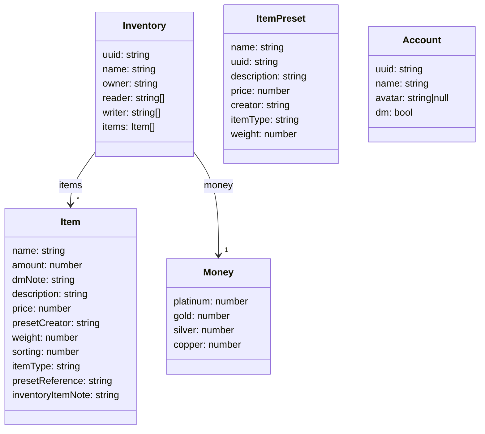

# Frontend

🖥️ Webview for the InventarWerk. Used to manage the inventory of the InventarWerk.
🔒 Only allows users to perform the actions they have permission to do.
📱 Developed mobile first, to allow users to use it in a small form factor on the table
🔄 Syncs with the backend to get the latest data and to update the data.

## Project Setup

```sh
npm install
```

### Compile and Hot-Reload for Development

```sh
npm run dev
```

### Type-Check, Compile and Minify for Production

```sh
npm run build
```

### Build for hosting (auto sets the backend URL to its own)

```sh
npm run build:prod
```

### Lint with [ESLint](https://eslint.org/)

```sh
npm run lint
```

## Format with [Prettier](https://prettier.io/)

```sh
npm run format
```

## Frontend model
